# PersonCleaner v2 architecture

## Design invariants

1. **Local media is the anchor.** Provider person IDs are mutable observations, not the internal definition of a human identity.
2. **Media discovers people.** Only people credited on selected media enter an evaluation cohort.
3. **Evidence collection is read-only; commits are explicit.** Computed state and operator overrides remain private shadow data until an operator reviews the complete case-wide final projection and presses **Apply**.
4. **Network work is scheduled.** The UI executes bounded indexed reads and offline recalculation only.
5. **A name is never proof.** Normalized names and aliases can corroborate an already media-blocked candidate; they cannot create a candidate edge alone.
6. **Missing evidence is not destructive evidence.** Missing provider support becomes a review state.
7. **Pairs and clusters are different facts.** Pair evidence is retained independently; cluster joins must also satisfy every component-level constraint.

## Runtime flow

```mermaid
flowchart LR
    E["Read-only Emby library"] --> S["Stable 50 movie + 50 series + 50 episode sandbox plus explicit IDs"]
    S --> MQ["Provider media queue"]
    MQ --> C{"Fresh raw cache?"}
    C -->|yes| F["Existing flattened media evidence"]
    C -->|no| API["Rate-limited TMDB / TVDB fetch"]
    API --> H{"SHA-256 changed?"}
    H -->|no| F
    H -->|yes| P["Parse once and replace flattened rows"]
    P --> F
    F --> PQ["Media-discovered graph people"]
    F --> VQ["Current in-scope ID validation"]
    PQ --> PE["Full cached person enrichment"]
    VQ --> PE
    PE --> B{"Media-derived graph boundary"}
    B --> G["Offline provider graph + scoring"]
    G --> R["Connected local reconciliation regions"]
    R --> D["Persisted decisions + exact credit plans"]
    D --> UI["Indexed query-only dashboard"]
```



## Private workspace

The repository resolves the workspace from `IApplicationPaths.DataPath`:

```text
personcleaner-v2/
├── entity-resolution.db
├── entity-resolution.db-wal
├── entity-resolution.db-shm
└── payload-cache/
    ├── tmdb/media/{movie|series|episode}/<id>.json
    ├── tmdb/person/person/<id>.json
    ├── tvdb/media/{movie|series|episode}/<id>.json
    └── tvdb/person/person/<id>.json
```

Important table groups:

| Boundary | Tables | Purpose |
|---|---|---|
| Runs and cohort | `resolution_run`, `current_media`, `current_local_person`, `current_local_credit`, `current_provider_media`, `global_local_person` | Reproducible active snapshot and task telemetry, plus a non-scoring global binding safety index |
| Acquisition | `work_queue`, `cache_manifest`, `provider_absence_cache`, `fetch_failure`, `acquisition_observation` | Queue purpose, positive/absence TTLs, operational failures and run-scoped `PRESENT`/`ABSENT`/`UNAVAILABLE` evidence |
| Flattened provider index | `provider_media`, `provider_media_observation`, `media_external_id`, `provider_media_credit`, `provider_person`, `person_external_id`, `person_alias` | Compact queryable evidence, structured roles and acquisition scope; no UI JSON parsing |
| Human truth | `manual_bridge`, `provider_correction`, `correction_application` | Confirmed/rejected identity relations, persistent provider-fact overlays and per-run trigger audit |
| Pair and cluster audit | `resolution_pair`, `resolution_pair_feature`, `resolution_cluster`, `resolution_cluster_member` | Versioned pair features, disposition, component membership and separate identity/anchor confidence |
| Relationship audit | `resolution_decision`, `resolution_evidence`, `resolution_media`, `resolution_credit_assignment` | Pre-rendered relationship evidence and schema-8 per-decision assignment audit |
| Final case projection | `resolution_case`, `resolution_case_decision`, `resolution_case_person_snapshot`, `resolution_identity_outcome*`, `resolution_case_credit`, `resolution_case_credit_attribution`, `resolution_question*` | Case-wide current/final identities, final IDs, credit destinations, provider-native title owners, explicit durable correction choices, and indexed `PROBLEM`/`SATISFIED_CHANGE`/`SATISFIED_NO_CHANGE` presentation purpose |
| Apply audit | `identity_case_apply`, `identity_case_apply_change` | Reviewed plan hash and the exact committed operations; no delete mutation exists |

The schema is created idempotently by `ResolutionRepository`. It uses WAL, normal synchronous mode, foreign keys, a 30-second busy timeout, narrow primary keys, and reverse indexes for external-ID and person-credit lookup.

## Cache rules

For `(provider, entity type, media type, provider ID)`:

1. A manifest younger than the configured TTL plus an existing payload file is a complete cache hit when its `materializer_version` is current: no network and no parsing. Fresh cache answers remain usable when credentials or the network are unavailable.
2. An older materializer version parses the raw cache once, transactionally replaces the flattened entity rows, and advances the manifest version without a provider request. Parser changes therefore repair stored interpretations even when the provider payload hash is unchanged.
3. An expired or missing manifest causes a provider fetch with bounded exponential retry and provider-specific request spacing.
4. SHA-256 is calculated over the exact response text.
5. An unchanged hash at the current materializer version refreshes `last_fetched_utc` and skips parsing/flattening.
6. A changed hash is parsed and replaces only that entity's flattened rows.
7. An authoritative HTTP `404/410` is cached separately from failures and yields `ABSENT` until its TTL expires. If positive and absence caches overlap after a TTL configuration change, the newer authoritative observation wins.
8. A network, rate-limit, authentication, invalid-payload or other unusable result yields `UNAVAILABLE`; technical details stay in the failure cache and logs.
9. Every queued entity writes one run-scoped resolution outcome: `PRESENT`, `ABSENT`, or `UNAVAILABLE`. A fresh positive or absence cache is a usable provider answer for the run.
10. Queue reconstruction from existing flattened media credits makes interrupted runs resumable even when the next run is all cache hits.

### Person acquisition boundary

Selected media remains the sole cohort boundary. Provider people discovered from its credits may be marked graph-eligible when their current ID or normalized same-title name connects them to a locally credited Emby person. The current TMDB/TVDB bindings of those same local people are also queued as validation probes.

Explicit sandbox Emby movie, series and episode IDs are unioned with the deterministic sample. Explicit Emby person IDs add media directly credited to those people. When **Auto-expand affected-person media** is enabled, the initial subset's affected people are identified first and every provider-addressable movie, series or episode credited to them is added before hydration. Local people and credits remain restricted to that initial affected-person set, so co-credited people encountered only on completion titles provide evidence but do not receive incomplete recommendations of their own. The completion pass is bounded and does not traverse onward through those co-credited people. Independently, every live Emby person's TMDB/TVDB/IMDb bindings are copied into `global_local_person`. This table is an automatic-application veto only and is never loaded into the local anchor index. If a proposed identity has an out-of-scope owner, the decision action becomes `INCOMPLETE_SCOPE` and its final projection is an ordinary human-review problem case with Person Builder and Apply.

The enabled-by-default **Populate Case Review with out of scope media items** option is deliberately separate from calculation scope. When a case-review dialog opens, it reads live Emby media relationships for the case's existing people, deduplicates them against calculated assignments by person, media and role, and labels additions as outside evidence scope. Unchanged additions remain review-only; an operator reassignment is promoted into the normal preflight, full-list `UpdatePeople`, postflight and rollback path. This performs no provider hydration and does not alter the evidence run or its reviewed plan hash.

Both purposes fetch, cache and flatten the complete supported person envelope: primary name, aliases, birth date and recognized external IDs. A validation-only `PRESENT` record remains in the reusable provider index but is excluded from `ResolutionInput.ProviderPeople`; it cannot create a candidate, cluster or replacement merely because Emby currently carries that ID. If later media evidence or an operator correction marks the same key graph-eligible, the cached payload is reused without losing those facts.

Current-binding acquisition gates decisions that depend on the binding. `ABSENT` can justify review of removing that exact stale ID, `PRESENT` prevents absence from being inferred merely from missing credits, and `UNAVAILABLE` (including a missing run observation) withholds orphan or drift conclusions that would act against the binding.

HTTP `401/403` is also treated operationally as a provider-wide configuration failure: at most the already in-flight bounded workers can observe it, remaining work for that provider is not requested, and the run fails before resolution publishes new decisions. The last completed dashboard remains intact instead of repeating an authentication diagnostic on every person row.

External IDs are source-typed before storage. Wikipedia page slugs are not Wikidata identities; person IMDb IDs must match `nm<digits>`, media IMDb IDs must match `tt<digits>`, Wikidata IDs must match `Q<digits>`, and TMDB/TVDB IDs must be numeric. Unknown or malformed remote identifiers are ignored rather than coerced into a stable namespace.

### Parallel acquisition

TMDB and TVDB execute in separate bounded pipelines. Each pipeline uses a fixed number of long-lived workers instead of allocating one task per queue row. Provider-specific interval gates serialize only request start times, not the network wait, allowing bounded requests in flight. Default limits are four TMDB requests and two TVDB requests. TVDB bearer-token refresh is guarded by a separate single-flight semaphore.

Episodes use one provider request per selected episode and the normal payload cache. TVDB is addressed directly by its episode ID. TMDB is addressed without an episode-discovery request: the queue stores the parent TMDB series ID and Emby season/episode coordinates, then calls the exact episode-details route with external IDs and credits appended. Root episode `guest_stars`/`crew` and appended credit collections are merged and deduplicated. The routing coordinate is deliberately separate from the provider's returned episode ID; both become aliases of the same canonical episode, so acquisition mechanics do not alter scoring or case semantics.

Repository operations remain protected by a narrow lock and each queue/cache key is unique, so completion order cannot change the flattened result. The phase barriers are preserved: all media workers finish before locally relevant people are seeded, and all person workers finish before offline resolution begins.

## Provider correction overlay

Raw payloads and flattened provider tables are immutable inputs from the operator's perspective. Active `provider_correction` rows are applied deterministically after flattening and before canonical media resolution, candidate construction and scoring. The overlay supports:

- unusable or replacement media-to-person credit attributions and roles;
- unusable or replacement person/media external-ID crosswalks;
- unusable or replacement provider person names and birthdays;
- unusable or replacement local Emby provider bindings; and
- explicit same/different identity relations; and
- case-specific identity targets and Emby-credit destinations selected by contextual review.

Each scheduled or cached recalculation writes one `correction_application` row per active correction. A positive `matched_count` means the rule triggered against the run's source facts; `changed_count` records how many effective facts changed. A zero match remains an operator review state and is never interpreted automatically as a provider-side fix. Triggered rules emit an informational log line. Refreshing provider data never overwrites, deletes or silently resolves an operator correction.

The Provider corrections tab presents task-oriented dialogs rather than a generic table editor. Leaving a replacement blank means that the selected provider fact is unusable; entering a replacement substitutes that value only in effective analysis. Disabling is reversible, while removal deletes the rule and its application audit. Saving, enabling, disabling or removing a rule recalculates the latest cached decision set without provider requests. Recalculation loads global Emby people only when they own a native or external ID that the effective provider graph could assign, using partial indexes on each TMDB/TVDB/IMDb binding. It never materializes the full 300,000-person collision table. The final persistence transaction reuses one prepared SQLite statement per SQL shape across all decisions, pair features and case rows.

## Canonical media and candidate blocking

Each provider-media record maps to exactly one canonical asset key, preferring:

1. IMDb media ID;
2. TMDB ID (native or TVDB remote ID);
3. TVDB native ID; then
4. the native provider ID.

Movies, series and episodes all enter this same equivalence graph. A local episode retains its Emby ID, provider IDs, parent-series IDs and season/episode coordinates. Canonical keys discovered from fetched episode crosswalks are attached to that local row, including when Emby did not already contain a TMDB episode ID, so local credit mass and provider attributions meet on the same canonical truth key.

Candidate generation uses inverted indexes of canonical media keys and hard person external IDs. It does not calculate a TMDB-person × TVDB-person Cartesian product. A candidate exists when the profiles share a stable IMDb/Wikidata person ID, or when shared canonical media is corroborated by a compatible normalized name/provider alias. Sharing a production alone is cast proximity, not person-identity evidence.

This makes candidate construction proportional to observed cross-provider edges rather than the product of provider populations.

## Graph and scoring

Every media/name or external-ID blocked pair is scored and persisted before clustering. Automatic edges are considered strongest-first. Union-Find may join two components only when the proposed component contains:

- no operator-rejected pair, including a rejection reached transitively;
- no two different identities from the same provider.

Operator-confirmed bridges are explicit identity evidence, but still cannot cross an operator rejection. A same-name, role-compatible attribution to a different provider person prevents automatic matching. Provider metadata disagreements remain negative evidence, but are not logical component constraints.

Evidence model `person-evidence-v6` first resolves provider media records through the transitive equivalence graph of every observed native and external media ID. This avoids false filmography gaps when providers expose different subsets of the same crosswalk. It recognizes explicit TMDB-to-TVDB or TVDB-to-TMDB person cross-references as direct candidate evidence, but a native crosswalk cannot establish identity automatically without compatible shared-media attribution or an independently matching stable identifier. It then uses fixed contributions so scores remain comparable between runs:

```text
score = 0.35 × exact normalized name / sqrt(name frequency)
      or 0.20 × matching alias / sqrt(name frequency)
      + 0.25 × shared-credit containment
      + 0.20 × (1 - exp(-shared-credit count))
      + 0.15 × role agreement
      + 0.20 × exact known birthday

conflicting external ID: -0.30, or -0.15 when independent identifier evidence matches
conflicting birthday:    -0.25, or -0.15 when independent identifier evidence matches

dominant role-aware media attribution caps the combined metadata penalty at 0.15
```

Containment is `shared / min(left credit count, right credit count)`. Jaccard is retained as a diagnostic but does not penalize a provider for returning a smaller credit set. Exact role names score fully; a compatible role category scores partially. Missing birthdays, external IDs, roles and unmatched titles add neither support nor a penalty.

Episode attribution is intentionally media-specific: once two records are tied to the same canonical episode, the episode credit itself is the attribution signal and role text does not gate the link. Provider and Emby role values remain persisted and displayed for audit, but differences such as `GuestStar`, `Guest Star`, character names, or department labels cannot suppress an episode assertion. Movie and series attribution retains role-aware matching.

A shared stable person external ID or explicit provider-native person cross-reference starts from direct identity support. Conflicting birthdays and external IDs subtract deterministic penalties rather than erasing otherwise independent evidence. Role-aware media attribution is dominant when normalized primary/alias naming is compatible, at least one canonical title and role category agree, and no other same-envelope provider person has a compatible role attribution on any observed title. In that state, correlated metadata disagreements share a capped penalty and a positive evidence score above the automatic threshold may retain the link as `MATCH_WITH_CONFLICT`, even when the reduced displayed evidence strength falls below the ordinary threshold. A competing attribution caps the score at `0.55` and prevents automatic matching. Scores are clamped to `[0, 1]`. Default interpretation:

- `>= 0.75`: ordinarily join the shadow graph;
- `0.40–0.749...`: human review;
- `< 0.40`: do not propose an alignment.

The role-aware dominance rule is an explicit deterministic policy exception to those scalar bands; its positive score, applied metadata penalty and final evidence strength are persisted separately. Diacritics, punctuation and whitespace are normalized for name comparison. Name equality never creates a candidate by itself. The configurable values are decision thresholds only; the feature contributions are part of the versioned model. The persisted number is deterministic evidence strength, not a statistically calibrated probability.

## Gravitational resolution

Provider components are mapped to local Emby people through indexed current provider IDs, IMDb IDs, compatible normalized names, and overlapping local media. The local person with the greatest count of distinct matching media becomes the anchor. Provider drift therefore survives when the old provider key disappears but the person's local media footprint stays stable.

Cluster identity confidence is the weakest accepted pair edge needed by the component. Local-anchor confidence is stored separately: a direct current-ID binding is `1.0`; a media-mass-only binding is `mass / (mass + 1)`. Ordinary stable singleton bindings are omitted from provider-identity decisions because they contain no cross-provider identity inference.

### Connected local reconciliation

Component resolution is deliberately not performed one provider component at a time. The engine builds a sparse bipartite graph whose left vertices are constrained provider-identity components and whose right vertices are in-scope Emby people; direct IDs, compatible naming and canonical-media mass create the observed anchor edges. Every connected region is then classified once:

- one provider component to multiple Emby people is a `MERGE`;
- multiple provider components to one Emby person is a `SPLIT`; and
- multiple provider components to multiple Emby people is a `REALIGNMENT`.

This prevents an individually plausible merge from consuming an Emby person whose credits actually span two distinct provider identities. A realignment is automatic only when every provider component has one distinct direct Emby owner, every relevant local credit maps to exactly one component by canonical media plus compatible person naming and role attribution, and no unresolved human-review edge crosses the component boundary. If such an edge exists, the region is retained as one problem case whose primary classification is a possible cross-provider identity match. The operator's final placement of the two native provider IDs on one active Person Builder row or separate rows records `same` or `different`; any consequent credit correction is derived from that same layout.

For an actionable region, the engine persists each exact `KEEP` or `MOVE` relationship in `resolution_credit_assignment`. The change planner reads those rows verbatim and never reverse-infers shadow people or moves from current provider keys. Impact counts include only persisted moves. Provider IDs are left unchanged for a pure realignment.

Construction is proportional to the observed graph, not all people or all possible component/person pairs. Person-to-component adjacency and canonical-media-to-component inverted indexes drive connected-component traversal and credit assignment. Explicit sandbox additions and optional affected-person completion therefore remain bounded; neither performs transitive expansion through newly encountered co-credited people.

Every result remains a proposal in plugin shadow storage until case-specific operator approval or execution of the configuration-gated Mass Corrections task. The task is off by default and selects only unapplied `SATISFIED_CHANGE` rows from the latest completed run. Manual and mass application share the same live preflight, exact provider-ID/credit mutation, postflight, rollback, receipt, and audit path. Neither path deletes people, media, or images.

The calculation-time global-binding veto prevents an out-of-scope provider-ID owner from entering automatic application. It does not veto manual Apply: an operator-confirmed Person Builder grid is authoritative for the in-scope people and provider IDs it contains.

## Final identity, attribution and metadata policy

The correction projection separates three questions that have different consequences:

1. **Identity:** do provider person records represent the same human? Role-aware overlap and stable identifiers answer this. A birthday typo or secondary crosswalk conflict may remain a warning without undoing independently strong identity evidence.
2. **Attribution:** who does each provider say owns this exact role on this exact title? `resolution_case_credit_attribution` persists the provider-native person ID, provider-media ID, name and role beside the Emby assignment. A hard correction question exists only when providers select different final identities, one provider selects competing owners, or the credit cannot be assigned to a final identity.
3. **Metadata:** which external IDs or biography facts disagree? Native TMDB and TVDB person IDs are authoritative for their own namespaces. A provider's crosswalk into the other provider is fallback evidence, not authority over that provider's native ID. Conflicting IMDb claims and biography differences are retained as warnings unless they are the only available identity evidence.

Accordingly, exact provider agreement on a title/role is displayed as agreement even when one record carries a bad crosswalk. Metadata-only warnings do not enter the repair queue and never manufacture a per-title provider-choice question. Multiple native IDs from one provider inside one proposed final person, or multiple distinct final people demanded by one local relationship, remain hard stops.

## Confirmed Emby mutation and metadata-folder lifecycle

The manual `PersonCleanerEmbyMutationProbeV2` task confirmed the live Emby 4.10 mutation contract on 2026-08-24:

- `ILibraryManager.GetItemPeople(BaseItem)` does not hydrate `PersonInfo.Id`; the IDs are zero. Any identity-sensitive read must use `GetItemPeople(InternalPeopleQuery)` with `EnableIds = true`, `EnableProviderIds = true`, and `EnableGroupByName = false`.
- `UpdatePeople` is a full replacement of the media item's people rows. Moving one relationship must begin with the complete hydrated list and preserve every unrelated row. Replacing a source relationship and removing a source duplicate both round-tripped correctly.
- Person provider IDs can be set, replaced, and removed with `UpdateItem(..., ItemUpdateType.MetadataEdit)`.
- An ID-less `PersonInfo` passed to `UpdatePeople` is resolved into an Emby `Person`. Removing its final supporting relationship leaves the person row temporarily present with `IsDeadPerson = true`.
- Emby's normal cleanup subsequently removed that unreferenced person row without a PersonCleaner delete operation. Production credit commits therefore move relationships and allow Emby to own dead-person database cleanup.

Emby's person database lifecycle and metadata-folder lifecycle are separate. A metadata edit writes `person.nfo` beneath a path derived from the current person name and provider binding. Changing or removing the provider ID writes another path; it does not remove the earlier path. Deleting or automatically cleaning the Emby person row also does not imply that any of its historical metadata directories were removed. The probe observed all of these directories for one logical source person:

```text
<name>
<name>-tmdb-<original-id>
<name>-tmdb-<replacement-id>
```

It also observed orphan-sentinel directories remaining after the corresponding person was absent from Emby's database. Historical probe directories from the earlier diagnostics task demonstrate the same persistence.

Filesystem reconciliation is consequently a separate future phase, not part of a credit move or provider-ID transaction. It must:

1. derive the complete set of metadata directories currently referenced by live Emby people;
2. associate historical directory variants with an evidenced person transition rather than by display name alone;
3. treat an absent database row as necessary but insufficient deletion evidence;
4. account for files, artwork, NFO metadata, junctions and unexpected contents before proposing an action;
5. preview exact source and destination paths and collision behavior;
6. avoid overwriting a current directory or combining different people that share a name;
7. use a recoverable quarantine/move before permanent deletion; and
8. run only as an explicit, separately approved commit after a fresh database/filesystem preflight.

Until that phase exists, PersonCleaner may correct Emby database relationships and provider bindings but must not claim that historical person folders were corrected or removed.

## UI contract

The evidence page offers SQL-filtered problem, pending satisfied-change, and all-case views over the persisted case projection. `PROBLEM` means manual intervention or oversight is required; `SATISFIED_CHANGE` is eligible for Mass Corrections; `SATISFIED_NO_CHANGE` records an accepted result with no Emby mutation. Each summary includes:

- decision status and proposed shadow action;
- ordinary-language headline and explanation;
- chosen Emby anchor and provider identities;
- provider-identity evidence strength, local-anchor confidence and impacted-title count;
- expandable ordered evidence with verdicts and stored raw metrics; and
- a capped display set of impacted titles, while all impacted rows remain stored.

The **Open case** checkbox opens the holistic master/detail review dialog using the existing dialog replacement/parent-return lifecycle. Identity parents compare current and resulting Emby/provider IDs. Media rows show the native TMDB owner, native TVDB owner and whether those assertions agree on the final identity and role; keep/move/receive is a separate Emby action. There is no separate save-plan lifecycle and unresolved relation records do not create additional question controls: they are internal constraints inferred from the edited grid. The top-level **Apply** `ButtonItem` is always present for every active problem case, including layouts that currently need editing. Apply uses the current grid as the authoritative person-ID and media-credit layout: it re-reads live Emby, overwrites drift to match the grid, and never vetoes the operator because evidence or live metadata changed after calculation. It can fail only when the grid cannot be compiled into operations, a required Emby person/media item no longer exists, Emby rejects a write, or commit verification fails. Successful Apply atomically records the receipt plus the smallest set of contextual correction choices needed to reproduce the confirmed result on future runs. It does not serialize the complete person layout as identity-relation, local-binding or local-credit rules. A zero-mutation Apply is still a real confirmation and receipt. Interactive apply does not rebuild the whole provider graph; the next evidence task applies the new rules and refreshes related cases.

Apply reads each affected title's live people, reconciles every grid credit against that current list, then verifies the resulting grouped assignments. Temporary resolver tokens are installed once per destination person for the whole case and removed before commit verification.

## Deliberate non-goals in v2

- Deleting Emby people or media is not implemented. Credit moves are limited to relationships present in the evaluated snapshot, and every commit is guarded by live precondition checks.
- Name-only global search is not used because it recreates conflation risk.
- Provider requests are intentionally conservative and serial per provider. Cache behavior and bounded cohorts matter more than first-run throughput during algorithm development.
