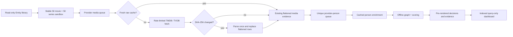

# PersonCleaner v2 architecture

## Design invariants

1. **Local media is the anchor.** Provider person IDs are mutable observations, not the internal definition of a human identity.
2. **Media discovers people.** Only people credited on selected media enter an evaluation cohort.
3. **Emby is read-only.** All computed state and operator overrides are private shadow data.
4. **Network work is scheduled.** The UI executes bounded indexed reads and offline recalculation only.
5. **A name is never proof.** Normalized names and aliases can corroborate an already media-blocked candidate; they cannot create a candidate edge alone.
6. **Missing evidence is not destructive evidence.** Missing provider support becomes a review state.

## Runtime flow



## Private workspace

The repository resolves the workspace from `IApplicationPaths.DataPath`:

```text
personcleaner-v2/
├── entity-resolution.db
├── entity-resolution.db-wal
├── entity-resolution.db-shm
└── payload-cache/
    ├── tmdb/media/{movie|series}/<id>.json
    ├── tmdb/person/person/<id>.json
    ├── tvdb/media/{movie|series}/<id>.json
    └── tvdb/person/person/<id>.json
```

Important table groups:

| Boundary | Tables | Purpose |
|---|---|---|
| Runs and cohort | `resolution_run`, `current_media`, `current_local_person`, `current_local_credit`, `current_provider_media` | Reproducible active snapshot and task telemetry |
| Acquisition | `work_queue`, `cache_manifest`, `fetch_failure` | Queue state, payload hashes/TTL, negative caching |
| Flattened provider index | `provider_media`, `media_external_id`, `provider_media_credit`, `provider_person`, `person_external_id`, `person_alias` | Compact queryable evidence; no UI JSON parsing |
| Human truth | `manual_bridge` | Confirmed or rejected cross-provider pairings |
| Presentation/audit | `resolution_decision`, `resolution_evidence`, `resolution_media` | Pre-rendered summaries, raw metrics and complete impacted-title attribution |

The schema is created idempotently by `ResolutionRepository`. It uses WAL, normal synchronous mode, foreign keys, a 30-second busy timeout, narrow primary keys, and reverse indexes for external-ID and person-credit lookup.

## Cache rules

For `(provider, entity type, media type, provider ID)`:

1. A manifest younger than the configured TTL plus an existing payload file is a complete cache hit: no network and no parsing.
2. An expired or missing manifest causes a provider fetch with bounded exponential retry and provider-specific request spacing.
3. SHA-256 is calculated over the exact response text.
4. An unchanged hash refreshes `last_fetched_utc` and skips parsing/flattening.
5. A changed hash is parsed and replaces only that entity's flattened rows.
6. A failure is recorded independently. Subsequent scheduled runs defer the entity until the configured retry window expires; an otherwise-fresh payload always wins over the negative cache.
7. Queue reconstruction from existing flattened media credits makes interrupted runs resumable even when the next run is all cache hits.

### Parallel acquisition

TMDB and TVDB execute in separate bounded pipelines. Each pipeline uses a fixed number of long-lived workers instead of allocating one task per queue row. Provider-specific interval gates serialize only request start times, not the network wait, allowing bounded requests in flight. Default limits are four TMDB requests and two TVDB requests. TVDB bearer-token refresh is guarded by a separate single-flight semaphore.

Repository operations remain protected by a narrow lock and each queue/cache key is unique, so completion order cannot change the flattened result. The phase barriers are preserved: all media workers finish before locally relevant people are seeded, and all person workers finish before offline resolution begins.

## Canonical media and candidate blocking

Each provider-media record maps to exactly one canonical asset key, preferring:

1. IMDb media ID;
2. TMDB ID (native or TVDB remote ID);
3. TVDB native ID; then
4. the native provider ID.

Candidate generation uses inverted indexes of canonical media keys and hard person external IDs. It does not calculate a TMDB-person × TVDB-person Cartesian product. A candidate exists when the profiles share a stable IMDb/Wikidata person ID, or when shared canonical media is corroborated by a compatible normalized name/provider alias. Sharing a production alone is cast proximity, not person-identity evidence.

This makes candidate construction proportional to observed cross-provider edges rather than the product of provider populations.

## Graph and scoring

Union-Find creates immutable graph components from:

- shared IMDb or Wikidata person IDs;
- operator-confirmed bridges; and
- probabilistic candidates at or above the automatic threshold.

Operator-rejected bridges remove that pair from consideration before scoring.

For remaining media-blocked candidates:

```text
score = 0.45 × filmography Jaccard
      + 0.25 × exact birthday
      + 0.20 × exact normalized primary name
      + 0.10 × matching provider alias
      - 0.50 × conflicting known birthdays
```

Scores are clamped to `[0, 1]`. A shared stable person external ID is a hard score of `1.0`. Default interpretation:

- `>= 0.75`: join the shadow graph;
- `0.40–0.749...`: human review;
- `< 0.40`: do not propose an alignment.

Diacritics, punctuation and whitespace are normalized for name comparison. Name equality never creates a candidate by itself.

## Gravitational resolution

Provider components are mapped to local Emby people through indexed current provider IDs, IMDb IDs, compatible normalized names, and overlapping local media. The local person with the greatest count of distinct matching media becomes the anchor. Provider drift therefore survives when the old provider key disappears but the person's local media footprint stays stable.

The result remains a proposal in plugin shadow storage. No `BaseItem`, provider ID, person record, relationship, image or Emby database row is mutated.

## UI contract

The evidence page loads at most the configured summary limit (default 100), ordered as `SPLIT`, `CONFLATION`, `DRIFT`, `ORPHAN`, then `MATCH`. Each summary includes:

- decision status and proposed shadow action;
- ordinary-language headline and explanation;
- chosen Emby anchor and provider identities;
- confidence and impacted-title count;
- expandable ordered evidence with verdicts and stored raw metrics; and
- a capped display set of impacted titles, while all impacted rows remain stored.

Confirm/reject actions write `manual_bridge` and rerun only the offline graph/scoring stage against flattened evidence. They issue no provider requests and update the current run's pre-rendered decision rows atomically.

## Deliberate non-goals in v2

- Applying proposals to live Emby is not implemented. That requires a separately reviewed commit protocol, backups, idempotent mutations and rollback semantics.
- Name-only global search is not used because it recreates conflation risk.
- Provider requests are intentionally conservative and serial per provider. Cache behavior and bounded cohorts matter more than first-run throughput during algorithm development.
