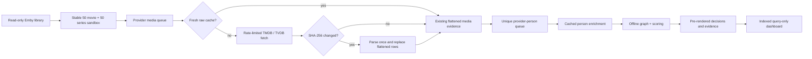

# PersonCleaner v2 architecture

## Design invariants

1. **Local media is the anchor.** Provider person IDs are mutable observations, not the internal definition of a human identity.
2. **Media discovers people.** Only people credited on selected media enter an evaluation cohort.
3. **Emby is read-only.** All computed state and operator overrides are private shadow data.
4. **Network work is scheduled.** The UI executes bounded indexed reads and offline recalculation only.
5. **A name is never proof.** Normalized names and aliases can corroborate an already media-blocked candidate; they cannot create a candidate edge alone.
6. **Missing evidence is not destructive evidence.** Missing provider support becomes a review state.
7. **Pairs and clusters are different facts.** Pair evidence is retained independently; cluster joins must also satisfy every component-level constraint.

## Runtime flow



## Private workspace

The repository resolves the workspace from `IApplicationPaths.DataPath`:

```text
personcleaner-v2/
├── entity-resolution.db
├── entity-resolution.db-wal
├── entity-resolution.db-shm
└── payload-cache/
    ├── tmdb/media/{movie|series}/<id>.json
    ├── tmdb/person/person/<id>.json
    ├── tvdb/media/{movie|series}/<id>.json
    └── tvdb/person/person/<id>.json
```

Important table groups:

| Boundary | Tables | Purpose |
|---|---|---|
| Runs and cohort | `resolution_run`, `current_media`, `current_local_person`, `current_local_credit`, `current_provider_media` | Reproducible active snapshot and task telemetry |
| Acquisition | `work_queue`, `cache_manifest`, `fetch_failure` | Queue state, payload hashes/TTL, negative caching |
| Flattened provider index | `provider_media`, `provider_media_observation`, `media_external_id`, `provider_media_credit`, `provider_person`, `person_external_id`, `person_alias` | Compact queryable evidence, structured roles and acquisition scope; no UI JSON parsing |
| Human truth | `manual_bridge`, `provider_correction`, `correction_application` | Confirmed/rejected identity relations, persistent provider-fact overlays and per-run trigger audit |
| Pair and cluster audit | `resolution_pair`, `resolution_pair_feature`, `resolution_cluster`, `resolution_cluster_member` | Versioned pair features, disposition, component membership and separate identity/anchor confidence |
| Presentation/audit | `resolution_decision`, `resolution_evidence`, `resolution_media` | Pre-rendered summaries, raw metrics and complete impacted-title attribution |

The schema is created idempotently by `ResolutionRepository`. It uses WAL, normal synchronous mode, foreign keys, a 30-second busy timeout, narrow primary keys, and reverse indexes for external-ID and person-credit lookup.

## Cache rules

For `(provider, entity type, media type, provider ID)`:

1. A manifest younger than the configured TTL plus an existing payload file is a complete cache hit when its `materializer_version` is current: no network and no parsing.
2. An older materializer version parses the raw cache once, transactionally replaces the flattened entity rows, and advances the manifest version without a provider request. Parser changes therefore repair stored interpretations even when the provider payload hash is unchanged.
3. An expired or missing manifest causes a provider fetch with bounded exponential retry and provider-specific request spacing.
4. SHA-256 is calculated over the exact response text.
5. An unchanged hash at the current materializer version refreshes `last_fetched_utc` and skips parsing/flattening.
6. A changed hash is parsed and replaces only that entity's flattened rows.
7. A failure is recorded independently. Subsequent scheduled runs defer the entity until the configured retry window expires; an otherwise-fresh payload always wins over the negative cache.
8. Queue reconstruction from existing flattened media credits makes interrupted runs resumable even when the next run is all cache hits.

External IDs are source-typed before storage. Wikipedia page slugs are not Wikidata identities; person IMDb IDs must match `nm<digits>`, media IMDb IDs must match `tt<digits>`, Wikidata IDs must match `Q<digits>`, and TMDB/TVDB IDs must be numeric. Unknown or malformed remote identifiers are ignored rather than coerced into a stable namespace.

### Parallel acquisition

TMDB and TVDB execute in separate bounded pipelines. Each pipeline uses a fixed number of long-lived workers instead of allocating one task per queue row. Provider-specific interval gates serialize only request start times, not the network wait, allowing bounded requests in flight. Default limits are four TMDB requests and two TVDB requests. TVDB bearer-token refresh is guarded by a separate single-flight semaphore.

Repository operations remain protected by a narrow lock and each queue/cache key is unique, so completion order cannot change the flattened result. The phase barriers are preserved: all media workers finish before locally relevant people are seeded, and all person workers finish before offline resolution begins.

## Provider correction overlay

Raw payloads and flattened provider tables are immutable inputs from the operator's perspective. Active `provider_correction` rows are applied deterministically after flattening and before canonical media resolution, candidate construction and scoring. The overlay supports:

- unusable or replacement media-to-person credit attributions and roles;
- unusable or replacement person/media external-ID crosswalks;
- unusable or replacement provider person names and birthdays;
- unusable or replacement local Emby provider bindings; and
- explicit same/different identity relations.

Each scheduled or cached recalculation writes one `correction_application` row per active correction. A positive `matched_count` means the rule triggered against the run's source facts; `changed_count` records how many effective facts changed. A zero match remains an operator review state and is never interpreted automatically as a provider-side fix. Triggered rules emit an informational log line. Refreshing provider data never overwrites, deletes or silently resolves an operator correction.

The Provider corrections tab presents task-oriented dialogs rather than a generic table editor. Leaving a replacement blank means that the selected provider fact is unusable; entering a replacement substitutes that value only in effective analysis. Disabling is reversible, while removal deletes the rule and its application audit. Saving, enabling, disabling or removing a rule recalculates the latest cached decision set without provider requests.

## Canonical media and candidate blocking

Each provider-media record maps to exactly one canonical asset key, preferring:

1. IMDb media ID;
2. TMDB ID (native or TVDB remote ID);
3. TVDB native ID; then
4. the native provider ID.

Candidate generation uses inverted indexes of canonical media keys and hard person external IDs. It does not calculate a TMDB-person × TVDB-person Cartesian product. A candidate exists when the profiles share a stable IMDb/Wikidata person ID, or when shared canonical media is corroborated by a compatible normalized name/provider alias. Sharing a production alone is cast proximity, not person-identity evidence.

This makes candidate construction proportional to observed cross-provider edges rather than the product of provider populations.

## Graph and scoring

Every media/name or external-ID blocked pair is scored and persisted before clustering. Automatic edges are considered strongest-first. Union-Find may join two components only when the proposed component contains:

- no operator-rejected pair, including a rejection reached transitively;
- no two different identities from the same provider;
- no conflicting known birth dates; and
- no conflicting stable IMDb or Wikidata person IDs.

Operator-confirmed bridges are explicit identity evidence, but still cannot cross an operator rejection. Automatic candidates must also be free of observed identity conflicts and competing same-name role attributions.

Evidence model `person-evidence-v3` first resolves provider media records through the transitive equivalence graph of every observed native and external media ID. This avoids false filmography gaps when providers expose different subsets of the same crosswalk. It then uses fixed contributions so scores remain comparable between runs:

```text
score = 0.35 × exact normalized name / sqrt(name frequency)
      or 0.20 × matching alias / sqrt(name frequency)
      + 0.25 × shared-credit containment
      + 0.20 × (1 - exp(-shared-credit count))
      + 0.15 × role agreement
      + 0.20 × exact known birthday
```

Containment is `shared / min(left credit count, right credit count)`. Jaccard is retained as a diagnostic but does not penalize a provider for returning a smaller credit set. Exact role names score fully; a compatible role category scores partially. Missing birthdays, external IDs, roles and unmatched titles add neither support nor a penalty.

A shared stable person external ID is hard support. Different values in a comparable stable-ID namespace cap the score at `0.15` (or `0.50` if another namespace matches); different known birthdays cap it at `0.25`; and a same-name, role-compatible attribution to a different provider person caps it at `0.55`. Any explicit identity conflict blocks automatic clustering regardless of the numeric score. Scores are clamped to `[0, 1]`. Default interpretation:

- `>= 0.75`: join the shadow graph;
- `0.40–0.749...`: human review;
- `< 0.40`: do not propose an alignment.

Diacritics, punctuation and whitespace are normalized for name comparison. Name equality never creates a candidate by itself. The configurable values are decision thresholds only; the feature contributions are part of the versioned model.

## Gravitational resolution

Provider components are mapped to local Emby people through indexed current provider IDs, IMDb IDs, compatible normalized names, and overlapping local media. The local person with the greatest count of distinct matching media becomes the anchor. Provider drift therefore survives when the old provider key disappears but the person's local media footprint stays stable.

Cluster identity confidence is the weakest accepted pair edge needed by the component. Local-anchor confidence is stored separately: a direct current-ID binding is `1.0`; a media-mass-only binding is `mass / (mass + 1)`. Ordinary stable singleton bindings are omitted from provider-identity decisions because they contain no cross-provider identity inference.

The result remains a proposal in plugin shadow storage. No `BaseItem`, provider ID, person record, relationship, image or Emby database row is mutated.

## UI contract

The evidence page loads at most the configured summary limit (default 100), ordered as `SPLIT`, `CONFLATION`, `DRIFT`, `ORPHAN`, then `MATCH`. Each summary includes:

- decision status and proposed shadow action;
- ordinary-language headline and explanation;
- chosen Emby anchor and provider identities;
- provider-identity confidence, local-anchor confidence and impacted-title count;
- expandable ordered evidence with verdicts and stored raw metrics; and
- a capped display set of impacted titles, while all impacted rows remain stored.

Confirm/reject actions write `manual_bridge`; typed provider corrections write `provider_correction`. Both rerun only the offline graph/scoring stage against effective cached evidence. They issue no provider requests and update the current run's pre-rendered decision rows atomically.

## Deliberate non-goals in v2

- Applying proposals to live Emby is not implemented. That requires a separately reviewed commit protocol, backups, idempotent mutations and rollback semantics.
- Name-only global search is not used because it recreates conflation risk.
- Provider requests are intentionally conservative and serial per provider. Cache behavior and bounded cohorts matter more than first-run throughput during algorithm development.
